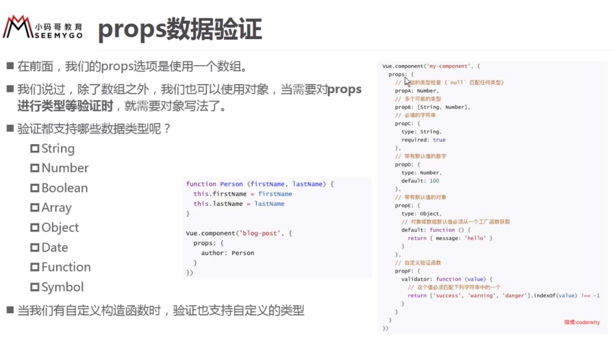
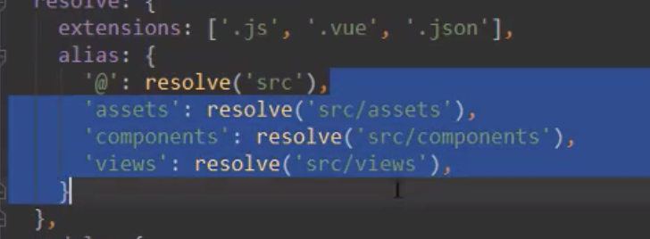
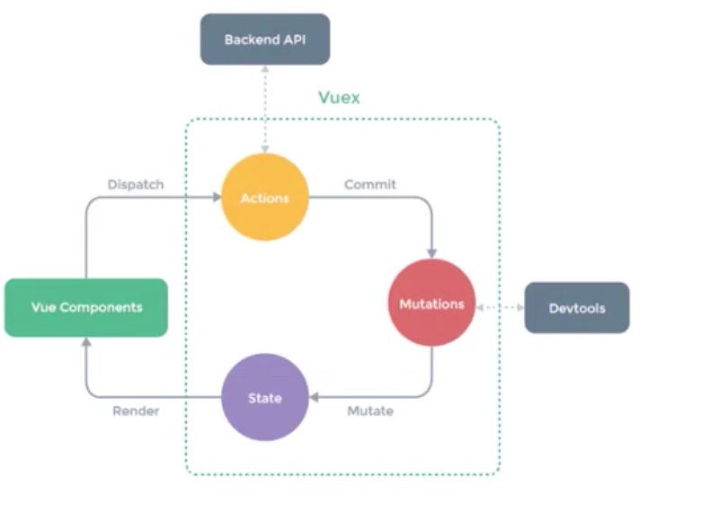
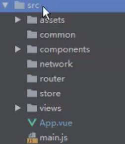
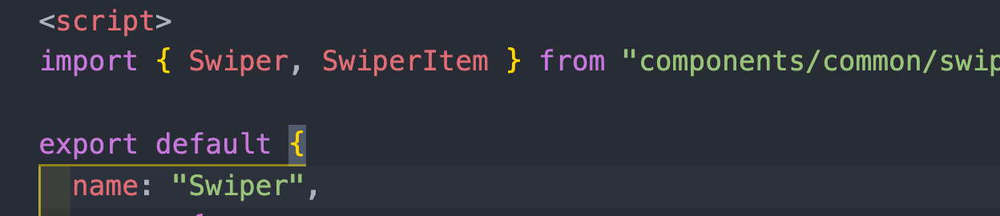
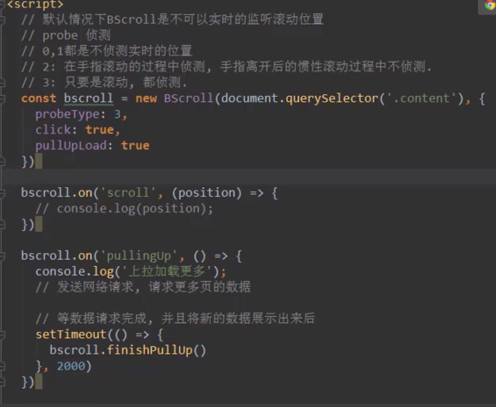
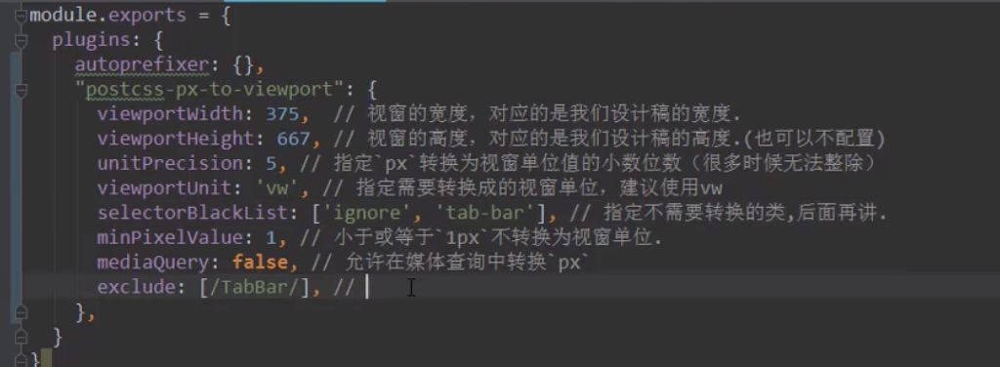
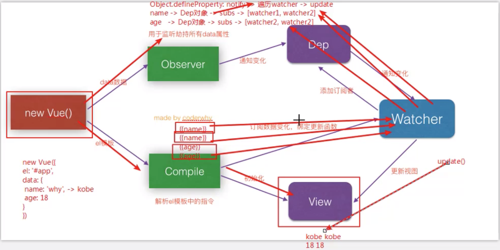

# VUE

### 入门

安装

1. CDN引入

   `<script src="https://cdn.jsdelivr.net/npm/vue"></script>`

2. 下载和引入

   开发环境 https://vuejs.org/js/vue.js

   生产环境 https://vue.org/js/vue.min.js

3. npm安装

案例

1. hellow,world

   ```vue
   <div id="app">
       <h2>{{message}}</h2>
     </div>
     <script src="../js/vue.js"></script>
     <script>
       const app = new Vue({
         el: '#app',
         data: {
           message: 'hello,vue.js'
         }
       })
     </script>
   ```

   > 注意：1.new Vuew({})的V要大写

2. v-for

   ```vue
   <body>
     <div id="app">
       <ul>
         <li v-for="item in movies">
           {{item}}
         </li>
       </ul>
     </div>
     <script src="../js/vue.js"></script>
     <script>
       const app = new Vue({
         el: '#app',
         data: {
           movies: ['闻香是女人', '盗梦空间', ' 霸王别姬']
         }
       })
     </script>
   </body>
   ```

3. 计数器

   ```vue
   <body>
     <div id="app">
       <h2>当前数字为：{{count}}</h2>
       <button @click="decrement">-</button>
       <button @click="increment">+</button>
     </div>
     <script src="../js/vue.js"></script>
     <script>
       const app = new Vue({
         el: '#app',
         data: {
           count: 0
         },
         methods: {
           decrement() {
             this.count--
           },
           increment() {
             this.count++
           }
         }
       })
     </script>
   </body>
   ```

模板语法

1. 常见指令

   + v-once:只渲染一次

     ```vue
     <h2 v-once>{{message}}</h2>
     ```

   + v-html:渲染html片段

     ```vue
     <h2 v-html="url"></h2>
     ```

   + v-text:渲染数据，但是不够灵活，只能渲染数据里面的内容

     ```vue
     <h2 v-text="url"></h2>
     ```

   + v-cloak:当Vue对象创建前存在这个属性，创建后这个属性消失，可以用来动态显示样式

     ```html
      <style>
         [v-cloak] {
           display: none;
         }
       </style>
      <div id="app">
         <h2 v-cloak>{{message}}</h2>
       </div>
     
     ```

     ```js
     setTimeout(function () {
           var vm = new Vue({
             el: '#app',
             data: {
               message: 'hahah'
             },
             methods: {}
           });
         }, 2000)
     ```

   + v-bind用于绑定属性
   
     ```vue
     
     ```
   
     > 语法糖写法   
   
   + v-bind动态绑定class
   
     对象语法
   
     ```vue
     <div v-bind:class="{key:value1,key2:value2}">
     </div>
     <div v-bind:class="{类名:boolean}">
     </div> 
     <div v-bind:class="{active:isActive,line:isLine}">
       {{message}}
     </div>
     ```
   
   + v-bind动态绑定style
   
     对象语法
   
     ```vue
     <p v-bind:style="{color:pColor,fontSize:finalFS +'px'}">阿拉善凯迪拉克函数</p>
     ```
   
   + computed计算属性
   
     ```js
     computed: {
             fullName: function () {
               return this.firstName + ' ' + this.laseName;
             }
           },
     ```
   
     > computed是计算属性，在使用的使用直接使用变量名，如{{fullName}}
     >
     > 注意：computed是有缓存的，第一次调用执行函数体，以后调用不执行函数体。
     
     computed setter与getter
     
     ```
           computed: {
             fullName: {
               set: function (newValue) {
                 this.firstName = newValue.split(' ')[0];
                 this.lastName = newValue.split(' ')[1];
                 console.log("1111");
               },
               get: function () {
                 return this.firstName + ' ' + this.lastName
               }
             }
           },
     ```
     
   + v-on
   
     > 在事件定义是，写方法时省略了小括号，但是方法本身是需要一个参数的，这个时候Vue会默认将浏览器生产的event事件对象作为参数传入到方法
   
     ```vue
     <button @click="btnClick"></button>
     btnClick(event) {
               console.log(event)
             }
     ```
   
     > 当既需要传递参数又需要传递事件时，可以使用$envent
   
     ```vue
     <button @click="btn2Click('abc',$event)"></button>
     ```
   
   + v-on修饰符
   
     @click.stop 阻止冒泡
   
     @click.prevent 阻止默认行为
   
     @click.native -监听组件根元素的原生事件
   
     @click.once - 只触发一次回调
   
   + v-if v-else-if v-else  
   
     ```vue
       <div id="app">
         <div v-if="isUser">
           <label for="account">账号登录</label>
           <input id="account" type="text" placeholder="账号" key="account">
         </div>
         <div v-else>
           <label for="email">邮箱登录</label>
           <input id="email" type="text" placeholder="邮箱" key="email">
         </div>
         <button @click="isUser = !isUser">切换登录方式</button>
       </div>
     
     ```
   
     > key的作用是区别相同元素
   
   + v-show 与 v-if
   
     > v-show为false是，该元素增加display:none属性
     >
     > v-if为false时，不存在对应dom元素
     >
     > 所以显示与隐藏之间切换频繁用v-show,否则用v-if
   
   + v-for 遍历对象
   
     ```vue
     <ul>
           <li v-for="(value,key) in person">{{value}}{{key}}</li>
     </ul>
     <!-- 
     person: {
               name: "gzh",
               age: 29,
             }-->
     ```
   
   + Vue.set(this.letters,0,'bb')
   
     参数1，要修改的数组
   
     参数2，索引值
   
     参数3，修改后的值
   
     ```js
     //响应式数组方法
     // 1. pop
     // 2.push
     // 3.shift
     // 4.unshift
     // 5.splice
     // 6.split
     // 7.sort
     // 8.reverse
     // 9.Vue.set(this.letter, 0, 'c')
     // 10.Vue.delete()
     
     //不能响应的方法
     // this.letter[0] = 'b'
     ```
   
   + filters
   
     传入属性，对属性进行改造
   
     ```vue
     <h2>{{book.price | finalPrice}}</h2>
     ```
   
     ```js
     filters: {
             finalPrice(price) {
               return "￥" + price.toFixed(2);
             }
           }
     ```
   
   + v-model
   
        实现表单的双向绑定
   
     ```vue
     <input type="text" v-model="message">
     ```
   
     ​	radio
   
     ```vue
     <label for="male">
       <input type="radio" id="male" value="man" v-model="sex">男
     </label>
     <label for="frame">
       <input type="radio" id="frame" value="woman" v-model="sex">女
     </label>
     ```
   
     ​	checkbox
   
     ​	单选情况
   
     ```vue
     <label for="agree"><input type="checkbox" id="agree" v-model="isAgree"> 同意</label>
     ```
   
     ​	多选情况
   
     ```vue
     <input type="checkbox" id="" value="篮球" v-model="hobbies">篮球
           <input type="checkbox" id="" value="羽毛球" v-model="hobbies">羽毛球
           <input type="checkbox" id="" value="足球" v-model="hobbies">足球
           <input type="checkbox" id="" value="乒乓球" v-model="hobbies">兵乓球
     ```
   
     ```js
     isAgree: false,
     hobbies: []
     ```
   
     ​	select
   
     ​	单选情况
   
     ```vue
     <select id="" v-model="fruit">
       <option value="苹果">苹果</option>
       <option value="青枣">青枣</option>
       <option value="葡萄">葡萄</option>
       <option value="榴莲">榴莲</option>
     </select>
     ```
   
     ​	多选情况
   
     ```vue
     <select id="" v-model="fruits" multiple>
       <option value="苹果">苹果</option>
       <option value="青枣">青枣</option>
       <option value="葡萄">葡萄</option>
       <option value="榴莲">榴莲</option>
     </select>
     ```
   
     修饰符
   
     ​	lazy
   
     ​	当失去焦点或者按回车才会引起data的变化
   
     ```vue
          <input type="text" v-model.lazy="message">
     ```
   
     
   
     #### 组件化开发
     
     父子组件通信
     
     ```html
      <div id="app">
         <cpn :cmovies="movies" :cmessage="message">
         </cpn>
       </div>
       <template id="cpn">
         <div>
           <ul>
             <li v-for='item in cmovies'>
               {{item}}
             </li>
           </ul>
           <h2>{{cmessage}}</h2>
           <h2>{{selfProps}}</h2>
         </div>
       </template>
       <script>
         const cpn = {
           template: "#cpn",
           // props: ['cmovies', 'cmessage'],
           //父组件属性
           props: {	
             cmessage: String,
             cmovies: {
               type: Array,
               required: true,
               default () {
                 return ['不是海王', '不是海贼王']
               }
             }
           },
           data() {
             return {
               selfProps: '哈哈哈'//组件属性必须写成函数形式
             }
           }
         }
         var vm = new Vue({
           el: '#app',
           data: {
             message: "hello,world",
             movies: ['海王', '海贼王']
           },
           methods: {},
           components: {
             'cpn': cpn //局部注册组件
           }
     
         });
       </script>
     ```
     
     子传父操作
     
     子组件使用this.$emit()发射，
     
     父组件使用自定义事件接收
     
     ```vue
     <body>
       <div id="app">
         <cpn @itemclick='itemClick'></cpn>
       </div>
       <template id="cpn">
         <div>
           <button style="margin: 10px;" @click="btnClick(item)" v-for="item in categories" :key="item.id">
             {{item.name}}
           </button>
         </div>
       </template>
       <script>
         const cpn = {
           template: "#cpn",
           data() {
             return {
               categories: [{
                 id: 1,
                 name: "家电",
                 price: 100.00,
               }, {
                 id: 2,
                 name: "手机",
                 price: 100.00,
               }, {
                 id: 3,
                 name: "日用",
                 price: 100.00,
               }]
             }
           },
           methods: {
             btnClick(item) {
               this.$emit("itemclick", item);
             }
           }
         }
         var vm = new Vue({
           el: '#app',
           data: {},
           methods: {
             itemClick(item) {
               console.log(item.name);
             }
           },
           components: {
             cpn
           }
         });
       </script>
     </body>
     ```
     
     props验证具体图
     
     
     
     
     
     父组件访问子组件使用$children、 \$refs
     
     ```vue
     <div id="app">
       <cpn ref="children"></cpn>
     	<button @click="btnClick">按钮</button>
     </div>
     ```
     
     ```js
     btnClick() {
     	console.log(this.$refs.children.price);
     }
     ```
     
     子组件访问父组件使用$parent
     
     
     
     ### slot插槽
     
     > 使用插槽可以定义组件里不同的内容
     
     父组件
     
     ```vue
     <div id="app">
       <cpn>
         👌
       </cpn>
       <cpn>
         🈶
       </cpn>
       <cpn>
         😈
       </cpn>
     </div>
     ```
     
     子组件
     
     ```vue
       <template id="cpn">
         <div>
           <h2>你好啊,</h2>
           <slot></slot>
         </div>
       </template>
     ```
     
     具名插槽
     
     > 在插槽加上名字，可替换具体哪一个插槽
     
     ```vue
     <cpn1>
     	<span slot="left">标题</span>
     	<button slot="center">按钮</button>
     </cpn1>
     ```
     
     ```vue
      <template id="cpn2">
         <div>
           <slot name="left"><span>左边</span></slot>
           <slot name="center"><span>中间</span></slot>
           <slot><span>右边</span></slot>
         </div>
       </template>
     ```
     
     作用域插槽
     
     父组件获取子组件的数据
     
     ```vue
     <cpn>
       <div slot-scope="slot">
         <span v-for="item in slot.data">
         {{item}}
         </span>
       </div>
     </cpn>
     ```
     
     ```vue
     <template id="cpn">
       <div>
         <!-- <h2>你好啊,</h2>
       <slot></slot> -->
         <slot :data="pLanuage">
           <ul>
             <li v-for="item in pLanuage">{{item}}</li>
         </ul>
         </slot>
         </div>
     </template>
     ```
     
     
     
     
     
     ## 进阶
     
     脚手架安装
     
     `npm @vue/cli -g`
     
     vue解析顺序
     
     ```
     template->ast->render->vdom->ui
     ```
     
     初始化一个vue项目
     
     ` `
     
     #### vue-router
     
     html中的history模式
     
     [`History.back()`](https://developer.mozilla.org/zh-CN/docs/Web/API/History/back)
     
     前往上一页, 用户可点击浏览器左上角的返回按钮模拟此方法. 等价于 
     
     ```
     history.go(-1)
     ```
     
     **Note:** 当浏览器会话历史记录处于第一页时调用此方法没有效果，而且也不会报错
     
     
     
     [`History.forward()`](https://developer.mozilla.org/zh-CN/docs/Web/API/History/forward)
     
     在浏览器历史记录里前往下一页，用户可点击浏览器左上角的前进按钮模拟此方法. 等价于
     
     ```
     history.go(1)
     ```
     
     **Note:** 当浏览器历史栈处于最顶端时( 当前页面处于最后一页时 )调用此方法没有效果也不报错。
     
     
     
     [`History.go()`](https://developer.mozilla.org/zh-CN/docs/Web/API/History/go)
     
     通过当前页面的相对位置从浏览器历史记录( 会话记录 )加载页面。比如：参数为-1的时候为上一页，参数为1的时候为下一页. 当整数参数超出界限时( 译者注:原文为When `*integerDelta*` is out of bounds )，例如: 如果当前页为第一页，前面已经没有页面了，我传参的值为-1，那么这个方法没有任何效果也不会报错。调用没有参数的 `go() `方法或者不是整数的参数时也没有效果。( 这点与支持字符串作为url参数的IE有点不同)。
     
     
     
     
     
     [`History.pushState()`](https://developer.mozilla.org/zh-CN/docs/Web/API/History/pushState)
     
     按指定的名称和URL（如果提供该参数）将数据push进会话历史栈，数据被DOM进行不透明处理；你可以指定任何可以被序列化的javascript对象。
     
     **Note:** 在 Gecko 2.0 (Firefox 4 / Thunderbird 3.3 / SeaMonkey 2.1) 到 Gecko 5.0 (Firefox 5.0 / Thunderbird 5.0 / SeaMonkey 2.2)中， 被传递的对象使用JSON进行序列化. 从 Gecko 6.0 (Firefox 6.0 / Thunderbird 6.0 / SeaMonkey 2.3)开始，使用[结构化克隆算法](https://developer.mozilla.org/en/DOM/The_structured_clone_algorithm)进行序列化。这样，就可以让更多类型的对象被安全地传输。
     
     
     
     `History.replaceState()`
     
     按指定的数据，名称和URL(如果提供该参数)，更新历史栈上最新的入口。这个数据被DOM 进行了不透明处理。你可以指定任何可以被序列化的javascript对象。注意到Firefox现在忽略了这个title参数，更多的信息，请看[manipulating the browser history](https://developer.mozilla.org/en/DOM/Manipulating_the_browser_history)。
     
     > 更新历史栈，但无法返回
     
     
     
     安装
     
     ``` shell
     npm install vue-router -s -d
     ```
     
      使用
     
     1. 新建router文件夹并新建index.js文件
     
     2. 在文件中编写代码
     
        ```js
        import Vue from 'vue';
        import VueRouter from 'vue-router';
        import Home from '../components/Home.vue';
        import About from '../components/About.vue';
        
        // 1.注册VueRouter插件
        Vue.use(VueRouter);
        // 路由路径数组
        const routes = [
        	{
            path:"/home",//路径
            component:Home,
          },{
            path:"/about",
            component:About
          }
        ];
        // 2.创建VueRouter
        const router = new VueRouter({
          routes
        });
        
        // 3.导出router对象
        export default router;
        ```
     
     3. 在main.js中注册
     
        ```js
        import router from './router';
        
        new Vue({
          render: h => h(App),
          router
        }).$mount('#app');
        ```
     
     4. 在app.vue中使用
     
        ```vue
        <div id="app">
            <router-link to="/home">首页</router-link>
            <router-link to="/about">关于</router-link>
            <router-view />
          </div>
        ```
     
        >router-link跳转至组件的超链接
        >
        >router-view占位符，点击哪个路由就显示哪个组件
     
     5. 注意点
     
        如果修改成history模式
     
        ```js
        const router = new VueRouter({
          routes,
          mode:'history'
        });
        ```
     
        
     
        默认值,重定向
     
        在router数组首位中添加
     
        ```js
        {
          path: '',
          redirect: "/home"
        }
        ```
     
        `<router-link></router-link>`属性
     
        + tag属性，可以指定这个标签为哪个dom元素
     
        ```vue
        <router-link tag="button"></router-link>
        ```
     
        + replace属性，可以更新url并清除history。
     
        + 改变router-link当前选中的class
     
          ```js
          const router = new VueRouter({
            routes,
            mode: 'history',
            linkActiveClass: "active"
          });
          ```
     
          
     
        
     
     6. 通过代码修改路径
     
        `this.$router.push('/home')`
     
        `this.$router.replace("/about")`
        
        
        
     7. 动态绑定路由
     
        1. 在配置路由映射数组中修改路由地址
     
           ```js
            {
             path: "/user/:id",
             component: User
           }
           ```
     
        2. 修改link-router
     
           ```vue
           <router-link :to="'/user/'+userid" tag="span">我是用户相关</router-link>
           ```
     
        3. 在跳转页面获取该参数
     
           ```js
           $route.params.id
           ```
     
            
     
     8. 路由懒加载
     
        ```js
        const Home = () => import (../components/Home);
        ```
     
     9. 嵌套路由
     
        子路由
     
        ```js
        {
          path: "/home",
          component: Home,
          children: [{
            path: '',
            redirect: 'news',
          }, {
            path: 'news',
            component: HomeNews
          }, {
            path: 'message',
            component: HomeMessage
          }]
        ```
     
        在父组件中
     
        ```vue
            <router-link to="/home/news">新闻列表</router-link>
            <router-link to="/home/message">消息列表</router-link>
            <router-view></router-view>
        ```
     
     10. 传递query参数
     
        传递
     
        ```vue
        <router-link
              :to="{path:'/home/news',query:{name:'gzh',age:'18',sex:'man',habbits:['A','B','C']}}"
            >新闻列表</router-link>
        ```
     
        获取
     
        ```vue
        <ul>
              <li v-for="item in $route.query.habbits" :key="item">{{item}}</li>
            </ul>
        {{$route.query.name}}
        {{$route.query.age}}
        {{$route.query.sex}}
        ```
     
     11. 通过代码传递
     
         ```js
         this.$route.push({
         	path:"/home/message",
         	query:{
         		name:'GZH',
         		age:18,
         		sex:'female'
         	}
         })
         ```
     
     12. 全局导航守卫
     
         > 作用：在路由跳转前的一个回调函数，写在router->index.js中
     
         `router.beforeEach()`
     
         示例：修改浏览器导航栏标题
     
         ```js
         {
           path: "/about",
           component: About,
           meta: {
             title: "关于"
           }
         }
         ```
     
         ```js
         router.beforeEach((to, from, next) => {
           document.title = to.matched[0].meta.title;
           console.log(to);
           next();
         });
         ```
     
         `router.afterEach()`后置钩子
         
     13. keep-alive 
     
         作用：切换组件时不被销毁,相当于缓存组件
     
         ```vue
         <keep-alive exclude="User">
         	<router-view />
         </keep-alive>
         ```
     
         > exduce属性为将User组件排除，即User组件不缓存
     
          有了keep-alive后，有两个钩子函数
     
         `activated()` 显示当前组件
     
          `deactivated()` 不显示当前组件
     
         ### Toolbar案例
     
         需要注意的点
     
         #### css部分
     
         + 全局 样式
     
           在assets文件夹新建css文件夹，创建全局css文件base.css
     
           然后再App.Vue文件的`<style></style>`中使用`@improt('./assets/css/base.css');`
     
         + toolbar高度一般使用`49px`
     
         + 固定地府使用`position:fixed;`固定 
     
         #### 路径问题
     
         给路径起别名，在vue配置文件中alias中
     
         
     
         在使用的时候直接使用assets,代替src/assets。
     
         > 如果是在tempalet中则使用~assets
     
     ### Vuex
     
     >  类似于redux
     
     安装
     
     `npm install vuex -s`
     
      
     
     使用步骤
     
     1. 安装
     
     2. 新建store.js
     
     3. 编写以下代码
     
        ```js
        import Vue from 'vue';
        import Vuex from 'vuex';
        
        Vue.use(Vuex);
        const moduleA = {
          state: {
            name: '郭泽鸿'
          },
          getters: {
            fullName(state) {
              return state.name + '-同学';
            }
          },
          mutations: {
            changeName(state) {
              state.name = 'gzh';
            }
          },
          actions: {
        
          },
        };
        
        export default new Vuex.Store({
          state: {
            count: 1
          },
          getters: {
            //正常
            getCountFomat(state) {
              return state.count + '次';
            },
            //调用getters中的方法
            getCountFomat1(state, getters) {
              return getters.getCountFomat + '啊';
            },
            //如果使用的时候有参数
            getCountFomat2(state, getters) {
              return function (msg) {
                return getters.getCountFomat1 + msg;
              };
            }
          },
          mutations: {
            increamCount(state) {
              state.count++;
            },
            decreamCount(state, payload) {
              state.count -= payload.count;
            },
            toZero(state) {
              state.count = 0;
            }
          },
          actions: {
            //context为上下文
            toZeroAsync(context, playload) {
              return new Promise((resolve) => {
                setTimeout(() => {
                  context.commit('toZero');
                  console.log("我在里面执行" + playload);
                  resolve('我是执行完的结果');
                }, 1000);
              });
            }
          },
          modules: {
            a: moduleA
          }
        });
        ```
     
        state为数据源，
     
        getters类似于computed属性，
     
        mutations一般写改变states值得方法，store状态更新的唯一方式
     
        actions发送网络请求
     
        moudles模块化操作，注意在调用模块的属性时，只有调用state里面的属性需要加上模块名，其他不需要
     
        ```vue
        {{$stroe.state.a.name}}
        {{$stroe.getters.getCountFomat()}}//会自动在根对象查找，查找不到在模块中查找
        ```
     
        
     
     4. 在main.js引用
     
        ```js
        new Vue({
          render: h => h(App),
          router,
          store
        }).$mount('#app');
        ```
     
     5. 在组件中使用
     
        ```vue
        <template>
          <div>
            <h2>当前计数:{{$store.state.count}}</h2>
            <h2>格式化数据:{{$store.getters.getCountFomat}}</h2>
            <h2>格式化数据1:{{$store.getters.getCountFomat1}}</h2>
            <h2>格式化数据2:{{$store.getters.getCountFomat2('我是参数')}}</h2>
            <button @click="add">-</button>
            <button @click="sub(5)">+</button>
            <br />
            <button @click="clearZero">归0</button>
            <br />
            <h2>------modules------</h2>
            <span>我的名字是:{{$store.state.a.name}}</span>
            <br />
            <span>我的名字是:{{$store.getters.fullName}}</span>
            <br />
            <button @click="changeClick">更新</button>
          </div>
        </template>
        
        <script>
        export default {
          name: "Counter",
          methods: {
            add() {
              this.$store.commit("increamCount");
            },
            sub(num) {
              // mutations第二种提交方式
              this.$store.commit({
                type: "decreamCount",
                count: num
           });
            },
         clearZero() {
              // this.$store.commit("toZero");
              this.$store.dispatch("toZeroAsync", "我是playload参数").then(result => {
                console.log(result);
              });
            },
            changeClick() {
              this.$store.commit("changeName");
            }
          }
        };
        </script>
        
        <style>
        </style>
        ```
     
        mapGetters,mapActions等等
     
        + mapGetters用于简写store中的getter方法
     
          ```js
          // 用法
          // 1.在需要用到的组件中引入
          import { mapGetters } from "vuex";
          // 2.在computed中添加
          ...mapGetters(["totalPrice", "totalCount"])
          // 3.使用,不用this.$store.getters.totalPrice
          this.totalPrice
          
          ```
     
        + mapActions类似
     
        ### 网络封装模块使用axios
     
        发送请求
     
        ```js
        $axios({
        	url:'',
        	type:'post',
        	params:{
        		id:1
        	}
        })
        .then((res)=>{
        	console.log(res.data);
        })
        ```
     
        发送并发请求
     
        ```js
        axios.all([axios.get("url1"),
        					axios.get('url2',
                            params:{{id:1}})
        					])
        					.then(axios.spread((res1,res2)=>{
        							console.log(res1);
        							console.log(res2);	
        					}));
        ```
     
        封装axios
     
        ```js
        import axios from 'axios';
        
        export function request(config) {
          const instance1 = axios.create({
            baseURL: "http://123.207.32.32:8000/",
            timeout: 5000
          });
          return instance1(config);
        }
        ```
     
        ```js
        import {request} from '../server/request'
        request({
              url: "/home/multidata"
            })
              .then(res => {
                console.log(res.data);
              })
              .catch(err => {
                console.log(err);
              });
        ```
     
        拦截器
     
        1. 请求拦截器
     
           ```js
           instance.interceptors.request.use(config => {
           	// 进行相关操作
             // 比如过滤headers，
             // 携带token
             config.data = Object.assgin({},config.data,Token);
           	return config;
           }, err =>{
           	//进行相关操作
           })
           ```
     
        2. 响应拦截器
     
           ```js
           instance.interceptors.response.use(res => {
           	return res.data;
           },err => {
             console.log(err);
           });
           ```
   


## 商城项目

### 项目准备

1. 划分目录结构

 

2. 在App.vue导入base.css和normalize.css文件初始化样式

3. 配置vue.config.js，设置路径别名

   ```js
   module.exports = {
     configureWebpack: {
       resolve: {
         alias: {
           'assets': '@/assets',
           'components': '@/components',
           'pages': '@/pages',
           'server': '@/server',
           'common': '@/common'
         }
       }
     }
   };
   ```

   

4. 将项目进行模块划分:tabbar->路由映射关系 


### 项目开发

1. 导航栏开发

2. 轮播图开发

   > 注意，在A组件中引用B组件，A组件的name不能和导入B组件的名字一样，否则会导致内存泄露；

   

3. 推荐组件

4. 货物列表

   使用better-scroll使滚动更加顺滑

   `npm install better-scroll`

   

   > 在vue中不能在ceated中初始化better-scroll，应在mounted中
   
   ```js
   //监听滚动
   this.bscroll.on("scroll", position => {
     this.$emit("scroll", position);
   });
   //监听上拉更新,当数据异步加载完成需要调用refresh刷新scroll
   this.bscroll.on("pullingUp", () => {
     this.$emit("pullingUp");
   });
   ```
   
   
   
   更多详细用法请查看better-scroll官网。
   
5. 事件总线，派发监听事件和响应事件

   + 在vue原型prototype中添加`Vue.prototype.$bus = new Vue();`

   + 被监听者

     ```js
     this.$bus.$emit("imageLoadFinish");
     ```

   + 监听者

     ```js
         this.$bus.$on("imageLoadFinish", () => {
         	//...
         });
     ```
     
   + 取消

     ```js
     this.$bus.$off("全局事件","当前函数")
     ```

     

6. 防抖函数 

   防止refresh多次调用。

   ```js
   debounce(func, delay) {
     let timer = null;
   	  return function(...args) {
         //判断是否有定时器，如果有清除掉定时器.
     		timer && clearTimeout(timer);
   		  timer = setTimeout(() => {
   		  func.apply(this, args);
   	  }, delay);
     };
   }
   ```

7. 吸顶效果

   + 获取组件的offsetTop

     `this.$ref.tabControl.$el.offsetTop`

8. mixin混入，将不同组件相同逻辑的代码放到一个mixin的方法里。

9. this.$nextTick(()=>()),当数据和dom全部渲染完会调用。

   > 用在标题滚动到内容
   
10. 安装自定义插件

  1. 在main.js注册`Vue.use(toast);`
  
  2. 新建一个js文件
  
     ```js
     import Toast from './Toast.vue';
     const toastObj = {};
     toastObj.install = function (Vue) {
       // 1. 创建组件构造器
       const toastConstructor = Vue.extend(Toast);
       // 2. 使用new 创建一个组件对象
       const toastComp = new toastConstructor();
       // 3. 将组件对象挂载到dom元素上
       toastComp.$mount(document.createElement('div'));
       // 4. toast.$el对应的div
       document.body.appendChild(toastComp.$el);
       // 5. 将对象挂载到Vue prototype上
       Vue.prototype.$toast = toastComp;
     };
     export default toastObj;
     ```
  
  3. 使用`this.$toast.show("您未选中商品");`

11. fastClick解决300ms延迟 

    `npm install fastclick` 

    在main.js照片那个使用 fastclick.attach(document.body)

12. 使用vue-lazyload实现图片懒加载

    `npm install vue-lazyload`

    在main.js使用

    ```js
    Vue.use(VueLazyLoad,{
    	loading:require("占位符图片");
    });
    ```

    将`:src`改为`v-lazy`

13. 移动端适配`postcss-px-to-viewport`插件改变css单位px为vm

    `npm install postcss-px-to-view --save-dev` 

    创建postcss.config.js




#### vue面试题

+ vue的响应式原理

  

  
  
+ 采用`Object.defineProperty(object,key,{get(){},set(newValue){}})`来监测属性值的改变

+ 采用订阅发布者模式来通知视图的更新

  ```js
  // 发布者
  class Dep {
    constructor() {
      this.subs = [];
    }
    addSubs(watcher) {
      this.subs.push(watcher);
    }
    notify() {
      this.subs.forEach(item => {
        item.update();
      });
    }
    remove(watcher) {
      this.subs = this.subs.fitler(item => item === watcher);
    }
  }
  
  // 订阅者
  class Watcher {
    constructor(name) {
      this.name = name;
    }
    update() {
      console.log(this.name + "发生改变,可以更新视图了");
    }
  }
  
  // 模拟data对象
  const obj = {
    name: "郭泽鸿",
    age: 18
  };
  
  Object.keys(obj).forEach((key) => {
    let value = obj[key];
    //一个属性新增一个dep对象
    let dep = new Dep();
    Object.defineProperty(obj, key, {
      set(newValue) {
        if (value === newValue) return;
        value = newValue;
        dep.notify();
      },
      get() {
        const watcher = new Watcher(value);
        dep.addSubs(watcher);
        return value;
      }
    });
  });
  ```

  